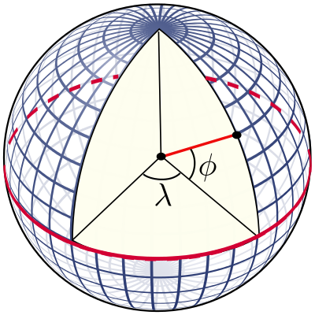
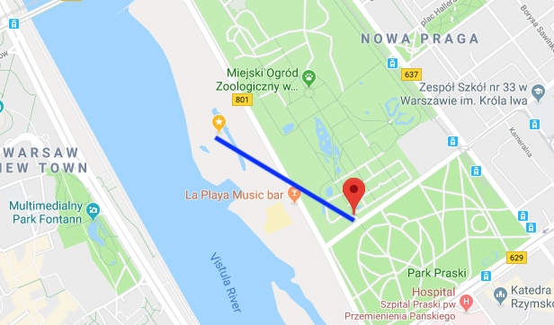

# Quickly finding closest coordinates using K-D-Trees

This post will demonstrate how to quickly find for a given coordinate (latitude and longitude), the closest coordinate out of a list of other coordinates using K-D-Trees and the Euclidian distance.

<!-- more -->

## Toy Problem: Finding population of nearest town for a given address

Let's say we have a list of addresses, and we want to know the population of the nearest town. This can be useful as a feature for a machine learning model. To do this we can:

- Use Google's [Geocoding API](https://developers.google.com/maps/documentation/geocoding/start) to convert addresses to coordinates.
- Download a free [geonames dataset](http://download.geonames.org/export/dump/) containing place names, population and coordinates.

I downloaded and unzipped the polish geonames dataset (`PL.zip`) and loaded with:

```python
import pandas as pd
geonames = pd.read_table("PL.txt", header = None, names = ["geonameid", "name", "asciiname", "alternatenames", "latitude", "longitude","feature_class", "feature_code", "country_code", "cc2", "admin1_code", "admin2_code", "admin3_code", "admin4_code","population", "elevation", "dem", "timezone", "modification_date"])
```

Now we simply need to determine the nearest coordinate for each address, and take the corresponding population. Let's say we have 10k address coordinates, and 60k place coordinates, and for each address we want to find the closest place population.

## Attempt 1: Great Circles

The first thing I tried was great circles: the shortest distance between any two points on a sphere.


The great circle distance $d$ is also known as the [haversine distance](https://en.wikipedia.org/wiki/Haversine_formula), given by:

$$
{\displaystyle d=2r\arcsin \left({\sqrt {\sin ^{2}\left({\frac {\varphi _{2}-\varphi _{1}}{2}}\right)+\cos(\varphi _{1})\cos(\varphi _{2})\sin ^{2}\left({\frac {\lambda _{2}-\lambda _{1}}{2}}\right)}}\right)}
$$

Where:

- *r*: is the radius of the Earth
- φ1, φ2: latitude of point 1 and latitude of point 2
- λ1, λ2: longitude of point 1 and longitude of point 2

Calculating the great circle distance between two coordinates is easy using a python package:

```python
from geopy.distance import great_circle
newport_ri = (41.49008, -71.312796)
cleveland_oh = (41.499498, -81.695391)
print(f"distance is {great_circle(newport_ri, cleveland_oh).km}")
#> distance is 864.2144943393627
```

I quickly ran into some problems however. Looping over 60k coordinates took ~8 seconds. We have 10.000 addresses so this is just going to take too long. The [time complexity](https://en.wikipedia.org/wiki/Time_complexity) of our approach is about `O(n)`. We can do better by getting a little bit smarter. Let's start by understanding what coordinates are first.

## Intermezzo: Coordinates

Coordinates are expressed as degrees; where [latitude](https://en.wikipedia.org/wiki/Latitude) ($\phi$) is the north-south angle that ranges from -90° (south pole), 0° (equator) to 90° (north pole). Early navigators could determine their latitude by measuring where Polaris (the North Star) was.

[Longitude](https://en.wikipedia.org/wiki/Longitude) ($\lambda$) is the east-west line, where it is agreed that 0 degrees is the meridian passing through Greenwich, England. The longitude ranges from -180° west to +180° east. Using coordinates and the radius of the earth, you can point to any place on earth. Determining the longitude is much harder however. Only in 1612 did Galileo Galilei devise a method using the exact time and the orbits of the moons of Jupiter. Finally in 1773 John Harrison invented the [marine chronometer](https://en.wikipedia.org/wiki/Marine_chronometer), a portable timepiece accurate enough to allow ships at sea to determine their longitude.



## Attempt 2: Euclidian distance

Now that we understand coordinates, what if we simplify a bit and calculate a straight line from coordinate A to coordinate B, in 3D space? This is called the [euclidian distance](https://en.wikipedia.org/wiki/Euclidean_distance) and is both easy and fast to calculate.

In order to use the Euclidean distance we’ll need to convert the latitude and longitude coordinates to the Cartesian plane; e.g. a x, y and z coordinate. To do that, we'll need to make some assumptions:

- The earth is a perfect sphere ([it's not!](https://en.wikipedia.org/wiki/Figure_of_the_Earth))
- Disregard elevation completely
- Approximate the radius of the earth as 6371 km.

Sure, we'll lose some accuracy, but that's fine given our use case. Denoting latitude by $\phi$, the longitude by $\lambda$ and the Earth's radius by $R$, the cartesian coordinates $\vec{r}$ are given by ([source](https://math.stackexchange.com/questions/29157/how-do-i-convert-the-distance-between-two-lat-long-points-into-feet-meters)):

$$
\vec{r}=\left(\begin{array}{c}x\\y\\z\end{array}\right)
=
\left(\begin{array}{c}
R\cos\theta\cos\phi
\\
R\cos\theta\sin\phi
\\
R\sin\theta
\end{array}\right)\;.
$$

Note these are trigonometric functions that use radians instead of degrees. To convert our latitude and longitude degrees to radius, we simply multiply by $ \pi / 180 $.
Now the Euclidean distance between two cartesian coordinates is given by:

$
d(\vec{r_1},\vec{r_2})=\sqrt{(x_2-x_1)^2+(y_2-y_1)^2+(z_2-z_1)^2}\;.
$$

Implementation in python:

```python
import math

def cartesian(latitude, longitude, elevation = 0):
    # Convert to radians
    latitude = latitude * (math.pi / 180)
    longitude = longitude * (math.pi / 180)

    R = 6371 # 6378137.0 + elevation  # relative to centre of the earth
    X = R * math.cos(latitude) * math.cos(longitude)
    Y = R * math.cos(latitude) * math.sin(longitude)
    Z = R * math.sin(latitude)
    return (X, Y, Z)

cartesian(*list((41.49008, -71.312796)))
#> (1529.060676779426, -4520.739477097017, 4220.726125555107)
```

A test with `%timeit` shows that it took about 850 nanoseconds to search over 60k coordinates! For 10k addresses, we can be done in 8.5 ms only at the cost of some accuracy. But our algorithm still has the same complexity `O(n)`:
we will still be checking 60k place coordinates for every address coordinates. So it's not very scalable and we can do even better.

## Finally: K-dimensional trees

We can use a [k-dimensional tree](https://en.wikipedia.org/wiki/K-d_tree) to organize our points in our 3-dimensional space. This is a data structure from computer science that can help with searches over multidimensional keys. [Scipy has KDtree implemented](https://docs.scipy.org/doc/scipy-0.14.0/reference/generated/scipy.spatial.KDTree.html), and for searches it uses euclidian distance by default (p=2) ! Let's build our tree data structure and a function to search it:

```python
from scipy import spatial

places = []
for index, row in geonames.iterrows():
    coordinates = [row['latitude'], row['longitude']]
    cartesian_coord = cartesian(*coordinates)
    places.append(cartesian_coord)

tree = spatial.KDTree(places)

def find_population(lat, lon):
    cartesian_coord = cartesian(lat, lon)
    closest = tree.query([cartesian_coord], p = 2)
    index = closest[1][0]
    return {
        'name' : geonames.name[index],
        'latitude' : geonames.latitude[index],
        'longitude' : geonames.longitude[index],
        'population' : geonames.population[index],
        'distance' : closest[0][0]
    }
```

A benchmark showed that instead of 8 sec, a search now took ~1.5 ms, more than 5000x faster! Actually, searching this tree structure has `O(log(n))` complexity.
Some manual checks suggested the lost accuracy was only very marginal. A visual confirmation of a random coordinate in Warsaw shows that the algoritm is working as intented:



## Conclusion

Go for the easiest and fastest solution whenever possible. But if you need some more speed, think about which assumptions you can make to simplify your problem. But before you do anything, properly analyse your dataset and think about your problem. In our toy case, geonames has many places with population zero, which we also could have excluded.
