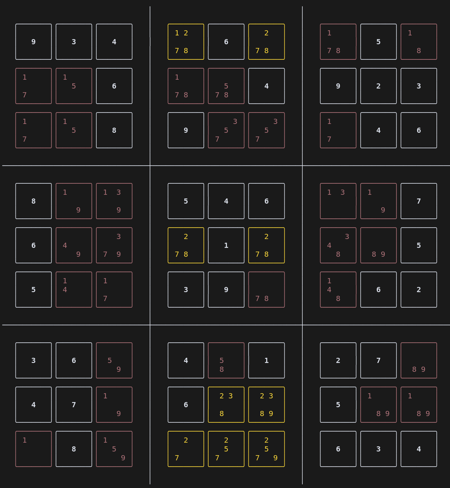

# Introducing an actually helpful sudoku solver

I occasionally enjoy playing [sudoku puzzles](https://en.wikipedia.org/wiki/Sudoku). I particularly like the harder ones that pose a real challenge. Play them and you will get stuck inevitable. I often wonder if I missed something obvious, or if I need to apply a more advanced strategy to solve this puzzle. So I wrote a sudoku solver that gives me the easiest possible strategy required to make progress. This blog has an interactive demo of the solver and reflects on how I wrote it.

<!-- more -->

First of all, why write a sudoku solver at all? There are many sudoku solvers out there, and you create a new one in 15 seconds using a modern LLMs ([example](https://chatgpt.com/canvas/shared/67db2e2738a0819184de700b8df43f98)). Sudoku's are very easy to solve with computers using a 'brute force' backtracking approach (see this cool [visualization](https://rafusel.github.io/sudokuVisualization/)), and can be implemented to be very fast using an efficient tree search algorithm. But a solver that tries each strategy that a human would use when using paper and pencil is much more interesting. Starting from the easiest strategy to the hardest. This is what I set out to build.

## Demo of the solver

Here is the final version of the sudoku solver. You can edit the grid and play with the code to solve any sudoku puzzle.

<iframe
  src="/assets/sudoku_solver_notebook/index.html?embed=true&show-chrome=false"
  width="100%"
  height="380"
  frameborder="0"
></iframe>

You can find the source code at [github.com/timvink/sudoku-solver](https://github.com/timvink/sudoku-solver). In case you're wondering, this demo is a [marimo notebook](https://docs.marimo.io/) exported to WebAssembly so it can run in the browser, embedded in this blog post ([see how](https://www.youtube.com/watch?v=W8nTSmZnQBs&pp=ygUNbWFyaW1vIHB5dGhvbg%3D%3D)).

## Common strategies for solving sudokus

Humans can use many different strategies, so the question is which strategies do we need to include? Many strategies rely on writing out the list of possible values that could go in each cell (also known as _markup_ and _pencilmarks_). There is even some theory on identifying preemptive sets using markup ([A Pencil-and-Paper
Algorithm for Solving
Sudoku Puzzles, Crook, 2009](http://www.ams.org/notices/200904/rtx090400460p.pdf)), but I will use the most common and well-known strategies as taken from https://www.sudokuoftheday.com/techniques. 

For example, the easiest strategy is the [Single Position](https://www.sudokuoftheday.com/techniques/single-position), where you choose a row, column or box, and then go through each of the numbers that hasn’t already been placed. If you're lucky, there will a number that has only one place it could go and you can fill it in. This is full list of 14 strategies implemented in the solver, from easy to hard:

=== "easy"

    - [Single Candidates](https://www.sudokuoftheday.com/techniques/single-candidate)
    - [Single Position](https://www.sudokuoftheday.com/techniques/single-position)


=== "medium"

    - [Candidate Lines](https://www.sudokuoftheday.com/techniques/candidate-lines)
    - [Double Pairs](https://www.sudokuoftheday.com/techniques/double-pairs)
    - [Multiple Lines](https://www.sudokuoftheday.com/techniques/multiple-lines)

=== "advanced"

    - [Naked Pairs](https://www.sudokuoftheday.com/techniques/naked-pairs-triples)
    - [Naked Triples](https://www.sudokuoftheday.com/techniques/naked-pairs-triples)
    - [Naked Quads](https://www.sudokuoftheday.com/techniques/naked-pairs-triples)
    - [Hidden Pairs](https://www.sudokuoftheday.com/techniques/hidden-pairs-triples)
    - [Hidden Triples](https://www.sudokuoftheday.com/techniques/hidden-pairs-triples)
    - [Hidden Quads](https://www.sudokuoftheday.com/techniques/hidden-pairs-triples)

=== "master"

    - [X-Wings](https://www.sudokuoftheday.com/techniques/x-wings)
    - [Swordfish](https://www.sudokuoftheday.com/techniques/swordfish)
    - `brute_force` (also known as "backtracking"). It will try all possible combinations and backtrack if there is a mistake. You could see this as a variant on the techniques [Forcing Chains](https://www.sudokuoftheday.com/techniques/forcing-chains), [Nishio](https://www.sudokuoftheday.com/techniques/nishio) and [Guessing](https://www.sudokuoftheday.com/techniques/guesswork).


Some remarks:

- I have not implemented [Y-wings](https://sudoku.com/sudoku-rules/y-wing/), although you do not need them given the other strategies.
- The implementation of `swordfish` includes both Swordfish-3 and Swordfish-4. Swordfish-4 is sometimes called "Jellyfish", and could be a separate strategy.
- [Forcing Chains](https://www.sudokuoftheday.com/techniques/forcing-chains) is not guesswork/brute force, but it's a lot of hard work if you had to do it by hand so it's basically the same thing.

## Object Oriented Design for the win

The goal is not speed but interpretability, and flexibility to express many different strategies with clarity. This is why I choose an _object oriented programming_ (OOP) approach. There is a main `Puzzle` class, `Row`, `Column` and `Block` classes and of course a `Cell` class. So for example a `Puzzle` has 9 `Row` instances, which has 9 `Cell` instances. A `Cell` is part of a row, column and block and manages the state of the cell's markup. By creating all the links, and adding some `__iter__` magic methods, we can do things like `c.remove_markup(5) in cell.row.cells if c != cell` to remove a `5` from all the cells in the same row as `cell`.

This project was a also a great application for using Python's `set` data structure extensively. Sets are great for keeping track of the possible values for a cell, and to do operations like `.intersection()`, `.difference()`, `.issubset()` and `.remove()`.

It was also interesting to see how strategies that are easy for humans to spot, are not necessarily easy to implement. The [double pairs strategy](https://www.sudokuoftheday.com/techniques/double-pairs) is a good example of this, as it's easy to spot, but the implementation involved a lot of cross referencing including concepts like block rows and block columns. Another example, the [`swordfish` strategy](https://www.sudokuoftheday.com/techniques/swordfish) is easy to understand for humans (but hard to spot), but the implementation involved having to track a chain of linked cells to find closed loops.

## Debugging and unit testing is paramount

For unit testing I not only need puzzles, but also the strategies required to solve them. [sudokuoftheday.com](https://www.sudokuoftheday.com/), which has a great daily list of puzzles with the strategies needed to solve them. I used Simon Willison's [git scraper](https://simonwillison.net/2020/Oct/9/git-scraping/) strategy and wrote a github actions that parsed the daily puzzles to a JSON format that I can use in my unit tests.

As my unit test suite grew with time, I kept running into more edge cases and bugs. Even though I had minimal examples for each strategy, I learned that having sufficient scale in sudoku puzzles was important to find edge cases.

Debugging also proved challenging. That's because a mistake from one strategy can propagate to where it will cause a validation error only later in the puzzle. I built validation and debugging tools into the `Puzzle` class, like `Puzzle.show_markup(digit: int)` (see screenshot).

<figure markdown="span">
  { width="300" loading=lazy }
  <figcaption>Markup for a double pair of 2s</figcaption>
</figure>

## Help from LLM's

I actually started this project 3 years ago, when coding with LLM's was not a thing. As I occasionally revisited this hobby project, LLMs became more advanced. I finished this project using [Cursor](https://www.cursor.com/) with Claude 3.5 Sonnet for coding. LLM-assisted coding is a joy as it takes out the boring parts. But I couldn't just [vibe-code](https://simonwillison.net/2025/Mar/19/vibe-coding/) my way through this project. LLMs failed with for something as well known as a sudoku puzzle, and despite a mature design of the `Puzzle` class, examples, unit tests, appropriate context and heavy LLM like `Claude 3.7 Sonnet Thinking` in agent mode. Take for example this prompt:

> I am writing a sudoku puzzle solver, see `@puzzle.py`. I've already implemented the double pairs strategy in `@double_pairs.py`, which implements the technique described in `@https://www.sudokuoftheday.com/techniques/double-pairs`. Now write the implementation for `@multiple_lines.py`, as described in `@https://www.sudokuoftheday.com/techniques/multiple-lines` .

It _did_ manage to write an implementation, but not a correct one. I had to carefully debug it and rewrites parts of it. It even made a basic mistake where it looked at rows where it should at columns.

Don't get me wrong, LLM's are great, and make these kinds of hobby projects much more fun. But ["using LLMs to write code is difficult and unintuitive"](https://simonwillison.net/2025/Mar/11/using-llms-for-code/). It's a productivity multiplier when used correctly, but it's going to build significant code bases just yet.

## Benchmarks - human strategies are fast

I never once tried to optimize for speed. But I notice that applying the strategies from easiest to hardest is _much_ faster than just using brute force (backtracing), especially on the easier puzzles (see charts below). I ran a separate benchmark on a set of 2000 puzzles which took 306 seconds (average solving time 0.2 seconds per puzzle). That is very slow.. specialized algorithms written in rust and running on multiple threads can solve all those puzzles in 1.188 seconds (see [benchmark repo](https://github.com/manatlan/sudoku_resolver)).

```vegalite
{
  "$schema": "https://vega.github.io/schema/vega-lite/v5.json",
   "title": "Solving with all strategies",
  "data": {"url" : "assets/json_data/sudoku/benchmark_results_full.json"},
  "encoding": {"y": {"field": "level", "type": "nominal", "title": null}},
  "layer": [
    {
      "mark": {"type": "rule"},
      "encoding": {
        "x": {"field": "lower", "type": "quantitative","scale": {"zero": false}, "title": "Time taken (s)"},
        "x2": {"field": "upper"}
      }
    },
    {
      "mark": {"type": "bar", "size": 14},
      "encoding": {
        "x": {"field": "q1", "type": "quantitative"},
        "x2": {"field": "q3"},
        "color": {"field": "Species", "type": "nominal", "legend": null}
      }
    },
    {
      "mark": {"type": "tick", "color": "white", "size": 14},
      "encoding": {
        "x": {"field": "median", "type": "quantitative"}
      }
    }
  ]
}
```

```vegalite
{
  "$schema": "https://vega.github.io/schema/vega-lite/v5.json",
   "title": "Solving with backtracking only",
  "data": {"url" : "assets/json_data/sudoku/benchmark_results_brute.json"},
  "encoding": {"y": {"field": "level", "type": "nominal", "title": null}},
  "layer": [
    {
      "mark": {"type": "rule"},
      "encoding": {
        "x": {"field": "lower", "type": "quantitative","scale": {"zero": false}, "title": "Time taken (s)"},
        "x2": {"field": "upper"}
      }
    },
    {
      "mark": {"type": "bar", "size": 14},
      "encoding": {
        "x": {"field": "q1", "type": "quantitative"},
        "x2": {"field": "q3"},
        "color": {"field": "Species", "type": "nominal", "legend": null}
      }
    },
    {
      "mark": {"type": "tick", "color": "white", "size": 14},
      "encoding": {
        "x": {"field": "median", "type": "quantitative"}
      }
    }
  ]
}
```

## What's next?

I learned a lot about sudoku, having to implement very specific solving strategies and dealing with their edge cases. Now can I go back to playing sudoku's with pen and paper.

A cool follow-up project build a webapp that uses the phone's camera input the sudoku puzzle and use the solver to tell what is the easiest strategy to apply to make progress.

You can find the full code of the sudoku solver on my [github.com/timvink/sudoku-solver](https://github.com/timvink/sudoku-solver).
