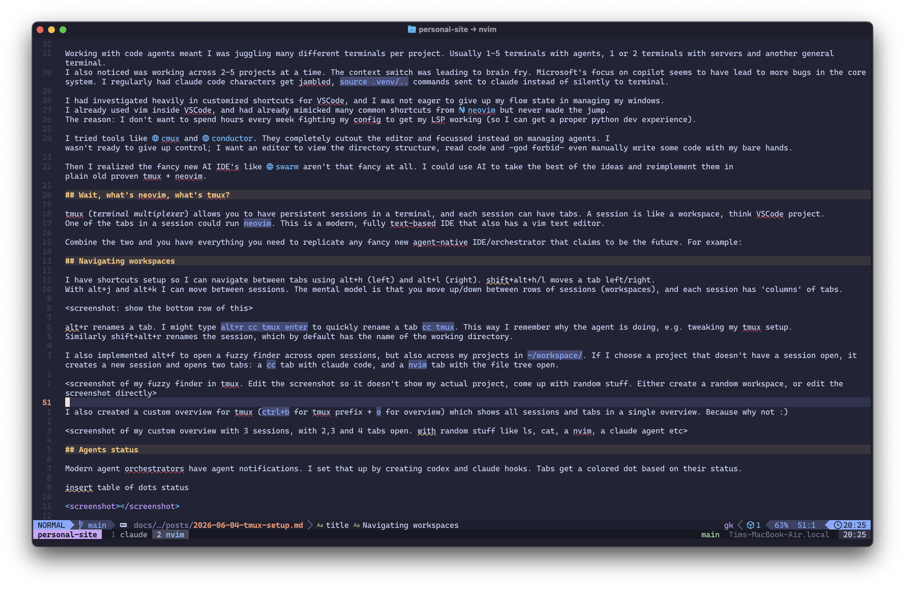
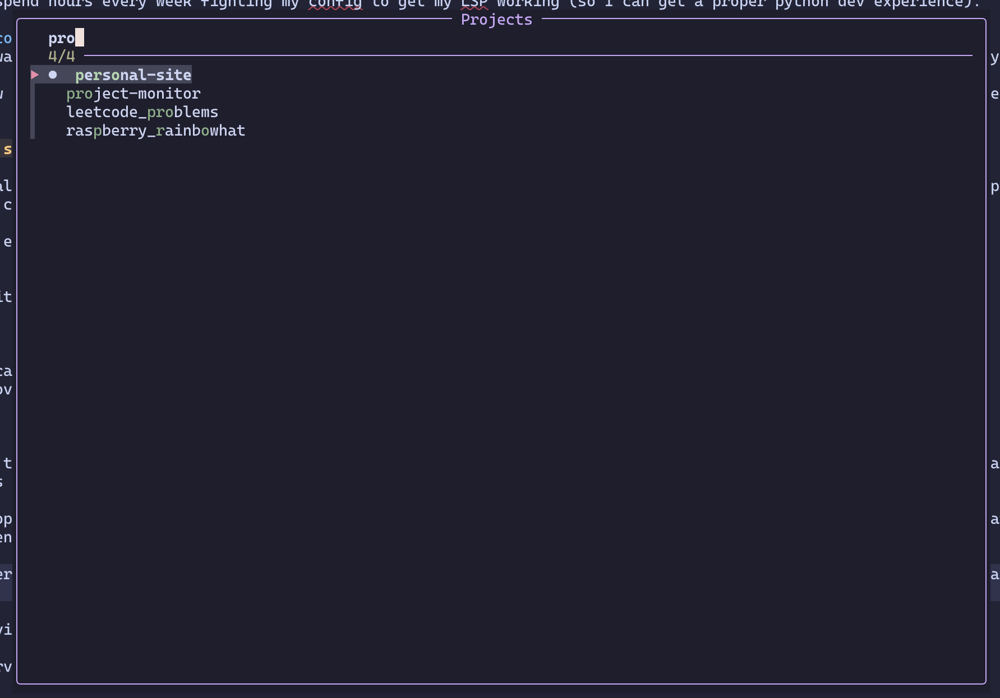
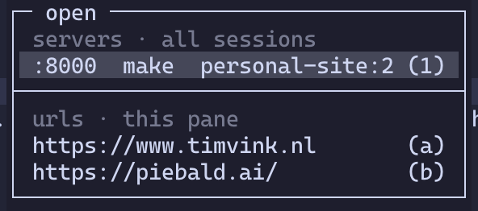

# My Malleable Dev Setup

David Heinemeier Hansson framed it eloquently: AI is making [computers malleable](https://world.hey.com/dhh/the-malleable-computer-7c187a9b) at a ferocious rate. *"Users can make systems their own with the help of AI and be utterly delighted by the outcome."*

I finally switched my development environment from VSCode to tmux+neovim. I'm utterly delighted. Let me share why.

<!-- more -->

## Why VSCode wasn't cutting it

Working with code agents meant I was juggling many different terminals per project. Usually 1-5 terminals with agents, 1 or 2 terminals with servers and another general terminal. I also noticed I was working across 2-5 projects at a time. The context switch was leading to brain fry.

Microsoft's focus on Copilot seems to have led to more bugs in the core system. I regularly had Claude Code characters get jumbled and `source .venv/..` commands sent accidentally to Claude by VSCode.

I had invested heavily in customized shortcuts for VSCode, and I was not eager to give up my flow managing windows. 
However, I already used vim inside VSCode, and had already mimicked many common shortcuts from [neovim](https://neovim.io/) to prepare to make the jump. But I never did, because I don't want to spend hours every week fighting my neovim config to get arbitrary things like Python dev setup (LSP) working, or fix broken LazyVim plugins after an update. But now the equation has changed: you can just point an agent at it with a quick *"fix it"* or *add x, y, z*.

I tried tools like [cmux](https://cmux.com/) and [conductor](https://www.conductor.build/). They cut out the editor and focused instead on managing agents. I'm not ready to give up all control; I want an editor to view the directory structure, read code and -god forbid- even manually write some code with my bare hands.

Then I realized the fancy new AI IDEs like [swarm](https://devswarm.ai/) aren't that fancy at all. I could use AI to take the best ideas and reimplement them in plain old proven and blazing fast tmux + neovim.

## Wait, what's neovim, what's tmux?

tmux (*terminal multiplexer*) allows you to have persistent sessions in a terminal, and each session can have tabs. A session is like a workspace, think VSCode project.
One of the tabs in a session could run `neovim`. This is a modern, fully text-based IDE that also has a vim text editor. Here's me using neovim with tmux to write this blog:

<figure markdown="span">
  
</figure>

## Replicating features

Combine tmux and neovim and you have everything you need to replicate any fancy new agent-native IDE. Go through the list of features, consider what you like, and build it for yourself. You get full control, your agent has all the context to debug and tweak your setup, and you don't have to switch tools and re-learn workflows and shortcuts.

Some highlights of my setup:

### Agents status

Modern agent orchestrators' main claim to fame is agent notifications. I set that up by creating Codex and Claude hooks. Tabs get a colored dot based on their status:

| Dot | State | Meaning |
|:---:|:------|:--------|
|  | `running` | The agent is working — producing output, or waiting on a tool. The challenge is to keep those agents working as much as possible.|
|  | `needs-input` | The agent is blocked on a question or an approval. Attention is needed. |
|  | `idle` | Turn complete, awaiting a prompt. |
|  | `none` | Tab with no agent running. Plain shells, `nvim`, and fresh claude code sessions don't need a state.|

The state is set by Claude Code and Codex lifecycle hooks, which calls a `agent-state` script that flips an `@agent_state` tmux option on the window. The status bar updates with the right colored dot per tab. I re-use this `@agent_state` across various custom tmux overviews.

You can take it further if you want. You could use AI to implement native system notifications. Or have an agent ping you using voice over your speaker (see f.e. [sag](https://github.com/steipete/sag/)).

### Worktrees and isolated workspaces

Another frequent claim of "AI IDEs" is *isolated workspaces*, which is usually just a layer on top of git worktrees. git worktrees are great, especially when working in parallel with multiple agents. But managing worktrees through the git cli is verbose and clunky. An abstraction on top makes sense, but it's just as easy to have an agent manage git worktrees for you.

No need for custom software, or even a custom skill: Claude Code supports `claude --worktree <name>` out of the box. However, I usually just say "use a git worktree", or add an entry to a project's `CLAUDE.md` requiring the use of worktrees before making changes. I set up a global skill that requests every project using worktrees to set up a `.gitworktreesinclude` (so certain .gitignore-ed files like `.env` get copied) and a `make setup` command to set up a fresh project state (like running `uv sync` to set up the `.venv`). And my tmux statusline also shows the current git branch in the active tab.

### Navigating workspaces

I have shortcuts set up so I can navigate between tabs using ++alt+h++ (left) and ++alt+l++ (right). ++shift+alt+h++/++shift+alt+l++ moves a tab left/right.
With ++alt+j++ and ++alt+k++ I can move between sessions. The mental model is that you move up/down between rows of sessions (workspaces), and each session has 'columns' of tabs. Here's a session with two tabs:

++alt+r++ renames a tab. I might type ++alt+r++ `cc tmux` ++enter++ to quickly rename a tab `cc tmux`. This way I remember what the agent is doing, e.g. tweaking my tmux setup.
Similarly ++shift+alt+r++ renames the session, which by default has the name of the working directory. ++alt+q++ breaks down the session closing all tabs, unless there is unsaved work or running agents. 

I also implemented ++alt+f++ to open a fuzzy finder across open sessions, but also across my projects in `~/workspace/`. If I choose a project that doesn't have a session open, it creates a new session and opens two tabs: a `cc` tab with Claude Code, and a `nvim` tab with the file tree open. I absolutely love this feature, and because I have [home row mods](https://precondition.github.io/home-row-mods) set up, it's a super quick hold on `s`
+ tap on `f`. No longer do I have to juggle 8 different VSCode applications and figure out which project is open in each.

<figure markdown="span">
  
  <figcaption>Fuzzy project finder</figcaption>
</figure>

I also created a custom overview for tmux (++ctrl+b++ for tmux prefix + ++o++ for overview) which shows all sessions and tabs in a single overview. Because why not :)

### Managing servers

I've seen too many `OSError: [Errno 48] Address already in use`. It meant I had to scan all my open projects and figure out which tabs were serving, and on what port. What I implemented instead is a port scanner and a wrapper that catches `make serve` and `make docs`. It's reliable, and adds the port(s) used by a tab next to the tmux tab. I also implemented a custom tmux window you can open with ++ctrl+b++ (the tmux prefix) + ++u++:

The url finder detects urls in the current pane, and shows running servers on other panes (including across other sessions). I can quickly open any url using ++enter++. Or use ++q++ to directly kill a server, without even having to jump to that terminal to press ++ctrl+c++.

## Final thoughts

I keep coming up with little tweaks to my setup almost daily. I recently started using a custom `/oneoff` command in Claude Code, where Claude and the terminal exit themselves after finishing. The workflow is: start a new Claude terminal (++alt+t++, `cc`) and then ask something like *"/oneoff add link X to my Notion page Y"*. Another example: I added a `y` and `Y` to copy relative/absolute paths to a highlighted file in the neovim file tree, so I can reference it quickly in Claude Code.

This pattern of using AI to create malleable computers holds elsewhere. For my homelab I started out using custom software like [zimaOS](https://www.zimaspace.com/zimaos). It's a small walled garden, and after fighting the limits for a while, I switched to a vanilla [ubuntu server](https://ubuntu.com/download/server). I was flying after that. Customized dashboards, Docker services, encrypted partitions for my password manager, and separate VPN mesh networks for exchanging encrypted backups; it was all easy and quick.

So go tweak your own development setup. If you want to re-use any of my ideas here, just point your agent at [github.com/timvink/dotfiles](https://github.com/timvink/dotfiles).
